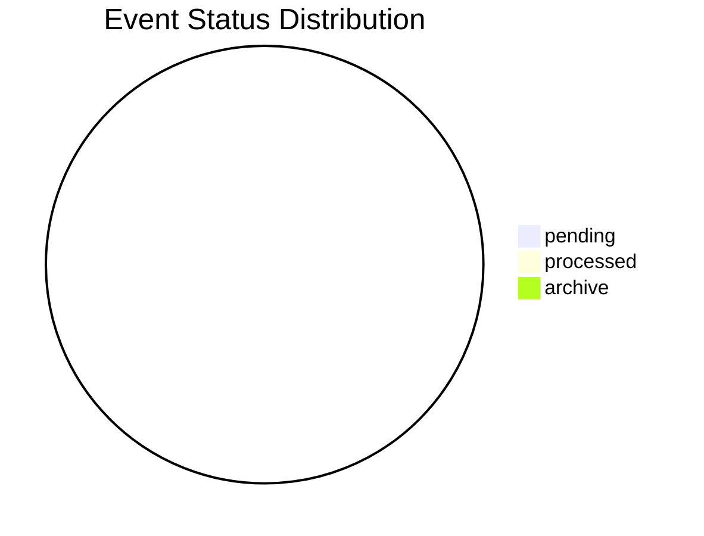
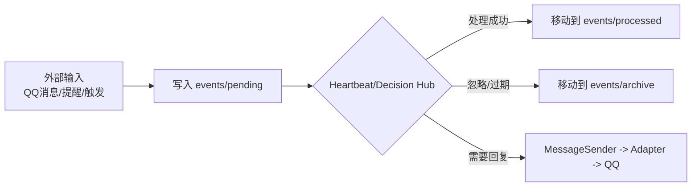
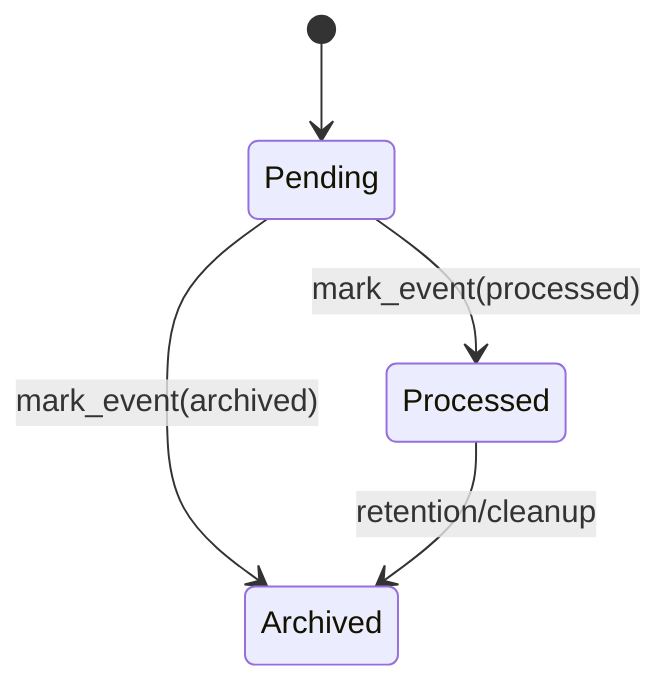
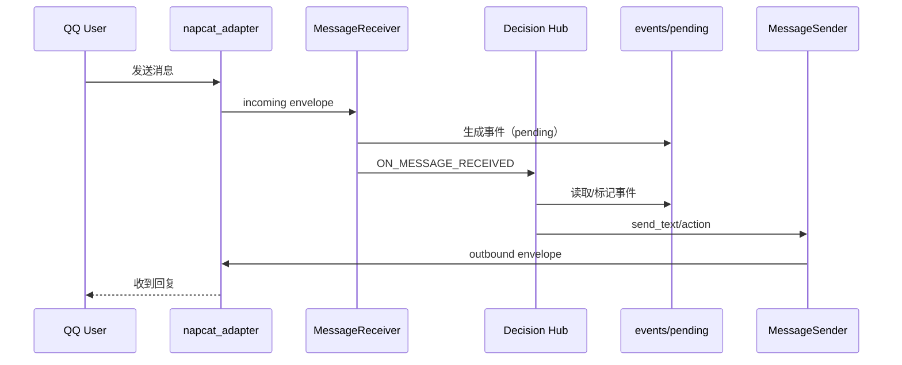

# 事件流可视化（Event Stream Visualization）

生成时间：`2026-03-27 22:50:09`  
事件目录：`/root/Elysia/Neo-MoFox-Loop/data/anysoul_workspace/events`

## 1. 当前状态总览

- 总事件数：`0`
- `pending`：`0`
- `processed`：`0`
- `archive`：`0`

## 2. 事件流主链路（系统视角）

## 3. 状态机（单事件视角）

## 4. 消息触发到回复（时序图）

## 5. 最新 Pending 事件

| id | type | source | priority | timestamp | file |
|---|---|---|---|---|---|
| (none) | - | - | - | - | - |
